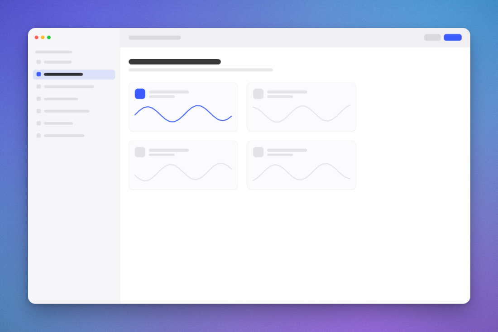
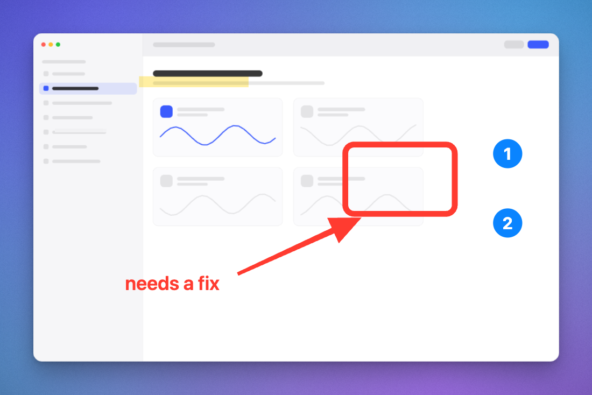

# MyShot

A screenshot beautifier — padding, rounded corners, layered shadows and mesh-gradient
backgrounds, plus cropping, annotation and redaction — in **one static HTML file**. No build
step, no dependencies, no server, no uploads. Open it and it works, including offline.





## Use it

Open `index.html` in Safari. That's the whole install.

**Pin it to the Dock** so it behaves like a small Mac app with its own window and icon:

> Safari ▸ **File ▸ Add to Dock…** (or the Share menu ▸ Add to Dock)

Then drop, paste, or open a screenshot.

| | |
| --- | --- |
| Drop a file anywhere on the window | replaces the current image |
| <kbd>⌘V</kbd> | paste a screenshot from the clipboard |
| <kbd>⌘O</kbd> | open the file picker |
| <kbd>⌘C</kbd> | copy the export to the clipboard |
| <kbd>⌘S</kbd> | save `screenshot-YYYYMMDD-HHMMSS.png` |

Every control is live — there is nothing to apply. Double-click a slider to reset it. Your
settings persist across reloads; your image does not.

## Crop and annotate

The tool strip sits under the canvas. Pick a tool, then drag once.

| key | tool | |
| --- | --- | --- |
| <kbd>V</kbd> | Select | click a mark to move it, drag its handles to resize, <kbd>⌫</kbd> to delete |
| <kbd>C</kbd> | Crop | drag a region, <kbd>⏎</kbd> to apply, <kbd>esc</kbd> to cancel |
| <kbd>A</kbd> | Arrow | hold <kbd>⇧</kbd> to snap to 15° |
| <kbd>R</kbd> | Rectangle | hold <kbd>⇧</kbd> for a square |
| <kbd>O</kbd> | Ellipse | hold <kbd>⇧</kbd> for a circle |
| <kbd>H</kbd> | Highlight | translucent marker, multiplied so text stays readable |
| <kbd>T</kbd> | Text | click, type, <kbd>⏎</kbd> to commit (<kbd>⇧⏎</kbd> for a new line) |
| <kbd>S</kbd> | Step | numbered badges, renumbered automatically when you delete one |
| <kbd>B</kbd> | Redact | pixelates the region — for tokens, emails and names |

<kbd>⌘Z</kbd> / <kbd>⇧⌘Z</kbd> undo and redo.

**Stroke weight is proportional to the image**, not an absolute pixel count — the four steps run
Fine, Regular, Bold and Heavy. A fixed 7px stroke is bold on a 640px screenshot and a hairline on
a 2880px retina capture; as a percentage of the image, Bold stays ~1% of the width whatever you
drop in. Arrows use an oversized head on a tapered shaft, because a proportionally small head is
the first thing to disappear once a screenshot is scaled down in a chat or a ticket.

**Cropping is non-destructive.** The full bitmap is kept, so you can re-crop or reset at any
time, and annotations stay pinned to the image features they point at rather than drifting.

**Redaction is pixelation, not blur.** Blur can sometimes be reversed; a mosaic cannot. The
block grid is derived from the region's size in source pixels, so a 2× export has the same
number of blocks — it can't leak detail that the preview didn't show.

Crop and annotations belong to the loaded image and are cleared when you drop a new one. They
are never written to `localStorage` — only your frame settings and the annotation colour and
stroke width persist.

## Copy to clipboard and `file://`

`navigator.clipboard.write` requires a **secure context**. Safari does not treat a page opened
directly from disk (`file://`) as one, so **Copy may be refused there** — Chrome is more
permissive and generally allows it.

When the write is refused, Copy does not fail silently: you get a visible error and a panel
holding the finished PNG, which you can drag straight into another app, right-click ▸ Copy
Image, or download. <kbd>⌘S</kbd> always works regardless.

To get Copy working unconditionally, serve the file over localhost, which *is* a secure context:

```sh
python3 -m http.server 8000    # then open http://localhost:8000/index.html
```

## Notes

- **Export at 1× is pixel-exact** — your screenshot is blitted 1:1 with no resampling. 2×
  doubles the canvas, which sharpens the synthetic parts (corners, shadow, gradient) but
  interpolates the screenshot itself. 1× is the default for that reason.
- **Padding is proportional** to the image, not an absolute pixel count, so it looks the same
  on a 320px thumbnail and a 3200px retina capture.
- **The preview is rendered at native device pixels** via `devicePixelRatio`, independently of
  the export multiplier — what you see is what you get.
- **Nothing leaves the machine.** No network requests of any kind; there is nothing to send.

## Repository

```
index.html        the entire application
docs/plan.md      architecture, the decisions behind it, and how it was verified
docs/prompt*.md   the original briefs
```

`docs/plan.md` is worth reading if you want the reasoning: the canvas shadow-scaling trap, how
shadows are cast from the screenshot's own alpha so transparent window corners work, and the
scale-invariance test that guards preview/export parity.
