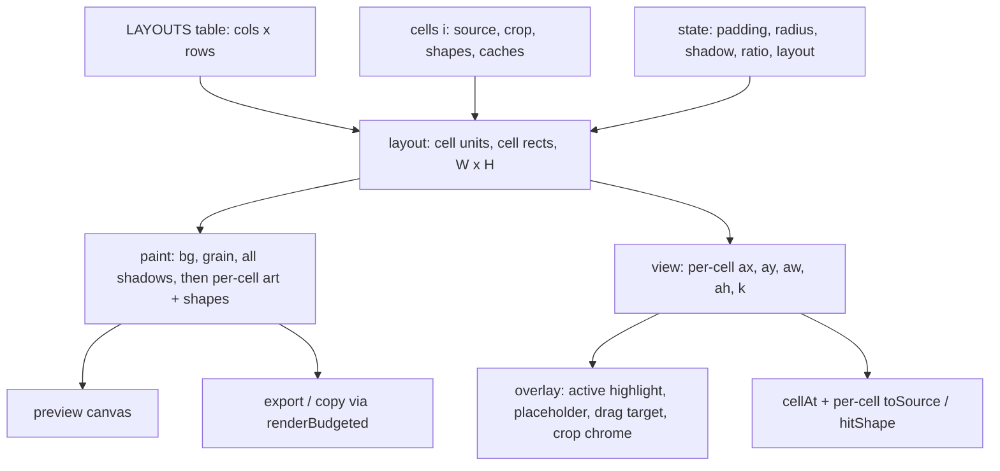
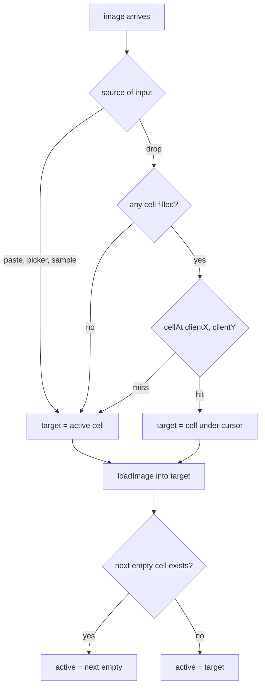

# Two-Up Collage Layout - Plan

## Goal Capsule

- **Objective:** A user can put two screenshots side by side as a before/after and export or copy the pair as one finished PNG, as quickly as they beautify a single shot today.
- **Means:** An N-cell layout model with "cell unit" geometry, shipping only the single and two-up layouts (KTD1, KTD2).
- **Authority:** Product Contract requirements win on behaviour; Key Technical Decisions win on mechanism within their cited requirements; units override neither.
- **Stop conditions:** Stop and report if single-layout output cannot be kept pixel-identical to today (R4), or if two-up would require breaking the synchronous export path that preserves Safari's clipboard gesture.
- **Execution profile:** One static `index.html`, vanilla JS, no build, no dependencies, no network. Verification is CDP-driven in a real browser and logged in `docs/plan.md`, as every prior feature was.
- **Finishes and ships:** `ce-work` implements and verifies; the user reviews the visual result before merge.

---

## Product Contract

### Summary

Add a layout switch to the Frame group so the stage can show one image or two equal-width cells side by side on one shared background. Each cell takes its own paste or drop, keeps its own crop and annotations, and the pair exports through the existing paint pipeline. The cell model is written for a general grid so a later four-up is a table entry plus UI.

### Problem Frame

Myshot beautifies one screenshot at a time. The user regularly wants a before/after: two captures placed side by side, styled once, saved as one image. Today that means exporting twice and composing elsewhere. The original brief excluded multi-image layouts (`docs/plan.md` scope table, `docs/prompt-revisited.md`), so the codebase assumes exactly one `source` in its state, caches, coordinate mapping and input paths.

### Requirements

**Layout and geometry**

- R1. A layout control in the inspector's Frame group switches between `single` and `two-up`; two-up renders two equal-width cells side by side, before on the left, after on the right, on one shared background.
- R2. Each filled cell's image scales to fit its cell: the cell width is the largest filled cell's visible content width (crop applied), that image renders 1:1 in composition units, a narrower image is scaled up to match the width, the cell height is the tallest scaled content, and images centre vertically in their cell.
- R3. Padding, corner radius, shadow and annotation weight are computed against the shared cell box, so both cells carry identical absolute treatment; the gutter between cells equals the padding.
- R4. In single layout, preview and export output are pixel-identical to today's, including cropped images.
- R5. Canvas ratio applies to the whole composition and grows the canvas, never crops it.

**Cell targeting**

- R6. Exactly one cell is active, and it is always a cell visible in the current layout. Clicking a cell, pressing `1` or `2`, or starting a drawing gesture in a cell makes it active. The active cell is marked on the overlay canvas and named by a visually hidden live region for assistive technology; the marking never appears in the export.
- R7. Paste, Open… and Sample load into the active cell. After any load into a cell, the active cell advances to the next empty visible cell if one exists, otherwise it stays. A load into any cell first commits an open crop on the cropping cell through the select-tool path, as a layout switch does.
- R8. Drag-drop loads into the cell under the cursor and highlights that cell while dragging over it; a drop outside every cell loads into the active cell. When no cell is filled, the existing full-screen drop veil is used.
- R9. Loading into a filled cell replaces that cell's image: the old bitmap is closed, that cell's crop and shapes reset, and the toast names the slot ("loaded into right").
- R10. Clear empties the active cell; clearing the last filled cell returns the stage to the empty state.
- R11. In two-up, an empty cell shows a dashed placeholder reading "Paste or drop here" on the overlay, with a matching visually hidden text equivalent in the DOM; when both cells are empty the existing empty state is shown and Export and Copy are disabled.

**Editing per cell**

- R12. Each cell keeps its own crop and shapes in that cell's source-pixel coordinates. Crop, Clear all and Reset crop act on the active cell. Drawing is clamped to the image of the cell under the pointer; a gesture that starts in an empty cell only activates it and switches to the Select tool. A Select hit on a shape in another cell makes that cell active, then selects the shape.
- R13. Undo is one shared stack. A snapshot captures every cell's crop and shapes plus the active cell; undo restores all of them and moves the active highlight to the cell that changed. Loading an image clears history, as today.
- R14. In crop mode the dim covers the whole composition; the active cell's crop frame, thirds guides and handles are drawn at that cell's scale.

**Layout switching**

- R15. Switching two-up to single keeps cell 0 visible and parks cell 1 (image, crop, shapes) in memory; if cell 0 is empty and cell 1 is filled, cell 1 is promoted to cell 0 instead of being parked. Switching back to two-up restores a parked cell. A switch first commits an open crop, drops any in-progress drag or selection, and clears the undo history as a load does; it pushes no history entry.
- R16. The layout choice persists in localStorage with the other settings; Reset does not change it; an unknown stored value falls back to `single`.

**Export and readouts**

- R17. Export and Copy are enabled when any cell is filled. An empty cell renders as bare background, and the result toast names the empty slot alongside the existing size note ("right slot empty").
- R18. The source readout lists each filled cell's dimensions; the export readout shows the composition size; 1× export means the largest image at native resolution.

**Documentation**

- R19. README "Using it" and "How it renders", the `docs/plan.md` scope table, and the drop veil copy describe the two-up behaviour and the new meaning of 1×.

### Key Decisions

- **Equal-width cells, images scaled to fit.** Mismatched screenshots still line up. (session-settled: user-approved — chosen over native-size cells and match-height cells: predictable before/after alignment.) Governs R2.
- **Per-image padding, radius and shadow on one shared background.** Reads as two screenshots, not a composite. (session-settled: user-approved — chosen over one frame around the pair: the pair should read as two distinct captures.) Governs R3.
- **Active-cell targeting with drop-under-cursor and auto-advance.** (session-settled: user-approved — chosen over fill-next-empty only: replacing one slot must not require clearing first.) Governs R6, R7, R8.
- **Full crop and annotation per cell in the first version.** (session-settled: user-approved — chosen over layout-and-export only: before/after shots usually need an arrow.) Governs R12, R13, R14.
- **Parking, not discarding, the right cell on a switch to single.** (session-settled: user-approved — chosen over discarding: a paste should not be lost by toggling.) Governs R15.
- **Export allowed with an empty cell, with a warning.** (session-settled: user-approved — chosen over blocking export: a single-slot export is still useful.) Governs R17.
- **Layout persists like every other setting.** (session-settled: user-approved — chosen over always starting single.) Governs R16.
- **One shared undo stack.** (session-settled: user-approved — chosen over per-cell undo: simpler and conventional for a canvas app.) Governs R13.
- **Before/After labels are deferred**, although external research shows they are the most requested addition to side-by-side views; they widen the ask. Governs Scope Boundaries.

### Success Criteria

- A before/after pair from two ⌘V pastes to a saved PNG takes no more clicks than today's single export plus one paste.
- Existing single-image exports for the sample source remain 1627×1087 at 1× and 3254×2174 at 2×, byte-identical for identical settings.
- A live shape drag in two-up on two 3360×2000 sources stays near the 16 ms frame budget recorded in `docs/plan.md`.
- Console stays clean and the page still makes zero network requests.

### Scope Boundaries

- Ratio presets, backgrounds, grain, edge, export scale and the 1MB budget apply to the composition as a whole; no per-cell variants.
- No warning for extreme mismatches (portrait beside landscape, a tiny icon beside a full screen); the fit rule in R2 applies and the result is what it is.
- The parked cell survives Clear in single layout; only clearing it in two-up or replacing it frees the bitmap.

#### Deferred to Follow-Up Work

- Four-up (2×2) layout: a `LAYOUTS` entry plus control and keys `3`/`4`; the geometry in this plan already handles a cols×rows grid.
- Optional "Before" / "After" labels drawn clear of the artwork (external research: the top request on side-by-side comparison views).
- Swapping or reordering cells; unequal cell widths; per-cell undo.
- An automated browser test harness; verification stays CDP-driven and logged, matching the repo.

#### Outside this product's identity

- Free-form multi-image stacking or collage editors with arbitrary placement.
- Image or photo backgrounds behind the cells.

### Acceptance Examples

- AE1. **Covers R2, R3.** Given cell 0 holds a 1440×900 image and cell 1 holds a 1280×800 image, when both are rendered, then cell 1's image is drawn at 1440 composition units wide, both cells have the same padding and shadow in pixels, and the composition is two cells plus three paddings wide.
- AE2. **Covers R4.** Given single layout with a crop applied, when exported, then the PNG matches today's export for the same crop and settings pixel for pixel.
- AE3. **Covers R7.** Given two-up with both cells empty and cell 0 active, when the user pastes twice, then the first image lands in cell 0, the active cell moves to cell 1, and the second image lands in cell 1.
- AE4. **Covers R8.** Given two-up with cell 0 filled, when a file is dragged over cell 1 and dropped, then cell 1 is highlighted during the drag and receives the file; cell 0 is untouched.
- AE5. **Covers R12.** Given a shape drawn in cell 1 at source coordinates, when the export scale changes from 1× to 2×, then the shape lands on the same image feature in cell 1 at both scales.
- AE6. **Covers R15.** Given two-up with both cells filled and a crop on cell 1, when the layout switches to single and back, then cell 1 returns with its image, crop and shapes.
- AE7. **Covers R15.** Given two-up with only cell 1 filled, when the layout switches to single, then that image is shown alone and Export stays enabled.
- AE8. **Covers R17.** Given two-up with only cell 0 filled, when Export runs, then the PNG has bare background where cell 1 would be and the toast says the right slot was empty.
- AE9. **Covers R16.** Given two-up selected, when the page reloads and then Reset is pressed, then the layout is still two-up.

### Open Questions

- **Multi-file drop (deferred to implementation, default chosen).** Dropping several files at once is not settled by R8. Default for this plan: keep today's behaviour of taking the first file only, and say in the toast that the others were ignored. Filling the next empty visible cell with the second file is the candidate follow-up if the user wants it.

### Sources

- `docs/plan.md` §3 render pipeline (composition units, no `ctx.scale`, shadow layers) and §6 crop/annotation model and verification method.
- `README.md` "How it renders" and "Guardrails" for the invariants the plan must keep.
- External: before/after layout guidance favouring tight gutters, identical styling per frame and labels (CombineMyImages guide); CleanShot X previews the drop target (left/right/top/bottom) before a second screenshot lands (TheSweetBits review); a screenshot-diff issue requesting Before/After labels on side-by-side views (github.com/PavelVanecek/screenshot-diff/issues/13). Saved run: `~/Documents/Last30Days/screenshot-before-after-side-by-side-comparison-raw-v3.md`.

---

## Planning Contract

### Key Technical Decisions

- KTD1. **Cells array replaces the single-image globals.** `source`, `sourceRev`, `crop`, `shapes` and both caches move into `cells[i]`; `active` is an index; `LAYOUTS` is a table of `{id, label, cols, rows}` holding `single` (1×1) and `two-up` (2×1). Geometry iterates the grid generically so four-up is a table row (Governs R1, R15; instantiates the equal-width Key Decision for R2).
- KTD2. **Composition units become cell units.** Cell width = the maximum visible content width over filled cells, where the cell currently in crop mode contributes its full frame. Each cell has a scale `k = cellWidth / contentWidth`. In single layout `k = 1` and the cell equals today's content box, so R4 holds. Chosen over cell width = minimum content width (downsamples the larger image at 1×) and over native frame width (breaks R4 whenever a crop exists, since today's units are the cropped content). The other cell may reflow while a crop gesture is open; it settles on Enter. This decision had concrete, comparable alternatives, so no bake-off was run.
- KTD3. **Shared metrics from the cell box, shadows before artwork.** Padding uses the longest cell edge, radius and stroke weight the shortest, shadow base the longest, all in cell units, so both cells match (R3). Paint order per frame: background, grain, every cell's shadow, then every cell's edge, artwork and clipped shapes. Shadow reach is capped at 1.25 × max(padding, 2% of the longest cell edge) and the blur can spread across the whole gutter, so drawing all shadows first is what stops cell B's shadow from painting over cell A's artwork; padding does not bound it.
- KTD4. **Per-cell caches behind one invalidation helper.** Each cell owns its artwork and crop caches keyed as today. The ten direct `artCache.key = ''` sites, and the crop-cache reset inside `resetEditing`, become `invalidate(cell)` or `invalidate()` for all cells. Without this a single-slot cache misses on every frame in two-up and loses the 16 ms drag budget.
- KTD5. **Per-cell view rects and a `cellAt` hit-test.** `view` carries one rect per cell `{ax, ay, aw, ah, k}` plus the layout `L`. `toSource`, `mapPoint`, `tolerance`, `hitHandle` and `strokeWidth` take a cell and divide or multiply by its `k`. `cellAt(clientX, clientY)` serves pointerdown, dragover and drop (Governs R6, R8, R12, R14).
- KTD6. **Load, clear and reset take a target cell.** `loadImage`, the sample canvas fallback, `clearImage` and `resetEditing` accept a cell; reset clears that cell's crop and shapes and the global tool, draft, selection and history. A load first commits an open crop on the cropping cell through the select-tool path, so the in-progress rectangle passes the same minimum-size and full-frame normalisation a finished gesture gets. Bitmaps are closed only when their own cell is replaced or cleared, so parking is safe (Governs R7, R9, R10, R15).
- KTD7. **Persistence through `DEFAULTS` with a Reset exclusion.** `layout` joins `DEFAULTS` so the typeof-merge in `load()` restores it under the unchanged `myshot.settings.v1` key, with a `LAYOUTS` whitelist beside the ratio guard; a small `RESET_SKIP` list keeps the Reset button from touching it (Governs R16).
- KTD8. **Drag feedback moves to the overlay when a composition exists.** The blurred full-screen veil hides the cells, so in two-up with any cell filled the veil stays off and the hovered cell is highlighted from `dragover` coordinates; with nothing rendered the existing veil path runs unchanged. Veil copy changes from "replaces the current one" to slot-aware wording. External prior art (CleanShot X) previews the landing slot before the drop (Governs R8).
- KTD9. **Selection stays an index into the active cell's shapes.** A Select hit elsewhere activates that cell first. Undo restores all cells and sets `active` to the cell whose snapshot differed when that cell is visible in the current layout; `active` always indexes a visible cell, and auto-advance searches visible cells only. Because a layout switch clears history (R15), no snapshot can outlive the cell indices it was recorded against (Governs R12, R13).
- KTD10. **Keys `1` and `2` select cells; no layout shortcut.** Digits are free today and extend to `3`/`4` later. While cropping, a digit commits the crop like Enter, then re-enters crop on the target if it is filled, otherwise drops to Select. In single layout `2` is a no-op.
- KTD11. **Fix the annotation weight readout while rewriting `syncOutputs`.** The readout multiplies by 0.012 but the stroke uses 0.016 (`docs/plan.md` §6a records the change to 0.016); the readout was missed. Correcting it is in the file being rewritten and costs nothing.

### High-Level Technical Design

Component flow: which pieces become per-cell and how they feed the shared paint and overlay.

Layout switch transitions (R15).

```mermaid
stateDiagram-v2
  [*] --> Single
  Single --> TwoUp: switch; cell 0 stays, parked cell 1 restored if any
  TwoUp --> Single: switch; commit crop, drop drag and selection
  state Single {
    [*] --> Shown0
    Shown0: cell 0 shown, cell 1 parked in memory
  }
  note right of TwoUp
    If cell 0 empty and cell 1 filled on switch to single,
    promote cell 1 into cell 0 instead of parking.
  end note
```

Input routing to a cell (R7, R8).

### Assumptions

- Before/after pairs are usually the same pixel size, so the upscale branch of R2 is the exception, not the rule.
- The Safari synchronous export path is unaffected: two-up only changes what `paint` draws, not when `toDataURL` runs.

---

## Implementation Units

### U1. Cell model and per-cell caches with single-layout parity

- **Goal:** Move image, crop, shapes and caches into `cells[]` with `active`, route every cache invalidation through one helper, and keep single-layout output identical.
- **Requirements:** R4; KTD1, KTD4, KTD6.
- **Dependencies:** none.
- **Files:** `index.html` (state block, `content`, `layout`, `getArtwork`, `croppedSource`, `resetEditing`, `loadImage`, `clearImage`, sample fallback, `pushHistory`, `undo`, all `artCache.key = ''` sites).
- **Approach:**
  1. Introduce `cells` as an array of one cell object and `active = 0`; keep `LAYOUTS` at a single entry for now.
  2. Make `content`, `layout`, `getArtwork` and `croppedSource` take a cell argument; `paint` and `render` pass `cells[active]`.
  3. Replace direct cache resets with `invalidate(cell)` / `invalidate()`.
  4. Thread a cell through `loadImage`, the sample canvas fallback, `clearImage` and `resetEditing` per KTD6; bitmap close only for the cell being replaced or cleared.
  5. Snapshot shape for history becomes an array of per-cell `{crop, shapes}` plus `active` (KTD9), still capped at 60.
- **Execution note:** Capture reference exports (1× and 2×, cropped and uncropped, sample source) before touching state, and diff against them after; this unit ships only when the diff is empty.
- **Patterns to follow:** existing cache keys in `getArtwork`; `resetEditing` semantics; history cap.
- **Test scenarios:**
  - Sample source, default settings: 1× export is 1627×1087 and 2× is 3254×2174, byte-identical to the pre-change reference.
  - Cropped sample with an arrow and a box: export byte-identical to pre-change reference.
  - Load, crop, undo, load a second image: history is empty after the second load and the first image's bitmap is closed.
  - Drag padding slider for two seconds on a 3360×2000 source: no artwork re-render per frame (cache hit), frame time near 16 ms.
  - Sample fallback path (force `toBlob` to fail): image lands in cell 0 with the same toast as the normal path.
- **Verification:** Pixel diff of the four reference exports is zero; console clean; all existing crop and annotation checks from `docs/plan.md` §6 still pass.

### U2. Grid geometry and multi-cell paint

- **Goal:** Compute cell units, per-cell rects and composition size for a cols×rows layout and paint every cell with shared metrics in the right order.
- **Requirements:** R2, R3, R5; KTD2, KTD3.
- **Dependencies:** U1.
- **Files:** `index.html` (`layout`, `paint`, `getArtwork`, `shadowLayers`, `drawShadow`, `strokeWidth`, `drawShapes`, `mapPoint`, `exportScale`).
- **Approach:**
  1. `LAYOUTS` gains `two-up` (2×1) so the geometry is reachable as soon as a control lands; `layout` reads the active entry, computes cell width per KTD2 (cropping cell contributes its full frame), each cell's `k`, cell height, gutter = pad, and returns `W`, `H`, `pad`, `radius`, plus a rect per cell in composition units with the image centred vertically.
  2. Padding, radius, shadow base and stroke reference come from the cell box (KTD3).
  3. `paint` draws background and grain once, then all cells' shadows, then per cell the edge hairline, artwork and clipped shapes. `getArtwork` sizes the artwork to `content × k × S`; its downscale branch compares output pixels against source pixels as it does today.
  4. `drawShapes` and `mapPoint` multiply source coordinates by the cell's `k`; `strokeWidth` uses the cell box.
  5. Ratio grow applies to the whole `W × H` as today; `exportScale` and the budget loop keep using `L.W`/`L.H`.
- **Technical design (directional):** cell rect `x_i = pad + i × (cellW + pad)`, `y = pad + (cellH - contentH_i × k_i) / 2`; composition `W = cols × cellW + (cols + 1) × pad` before ratio grow.
- **Patterns to follow:** explicit `× S` multiplication everywhere, no `ctx.scale`; shadow cast from artwork alpha via the off-canvas caster.
- **Test scenarios:**
  - Covers AE1. 1440×900 beside 1280×800: cell 1 artwork is 1440 units wide, composition width equals two cells plus three paddings, both shadows sample the same alpha at mirrored points.
  - Two identical 1440×900 images, padding 6.5%, radius 42: each cell's padding and radius in pixels equal the single-layout values for the same image.
  - Padding set to 0 in two-up: cells touch with no gutter; cell 1's shadow, whose reach floors at 2.5% of the longest cell edge regardless of padding, never alters pixels inside cell 0's artwork because all shadows paint before any artwork.
  - Padding at 3% on two dark screenshots: pixels along cell 0's right artwork edge are unchanged by cell 1's shadow (all-shadows-first ordering).
  - Ratio 16:9 in two-up: composition grows to exactly 16:9, cells stay centred.
  - Cell 0 in crop mode with a crop half its width: cell width equals the full frame width while cropping and drops to the crop width on Enter.
  - Single layout with a crop: geometry equals U1's reference (R4 preserved after the rewrite).
- **Verification:** This unit is gated on the single-layout reference diff (R4) and a clean console; its two-up measurements cannot be driven through the UI until U3 and U4 land (the app is a closed IIFE, so a CDP session cannot fill a second cell by hand) and are executed in U4's verification session.

### U3. Layout setting, control and switch semantics

- **Goal:** Add the `layout` setting and its segmented control, and implement park/promote and commit-on-switch.
- **Requirements:** R1, R15, R16; KTD1, KTD7.
- **Dependencies:** U2.
- **Files:** `index.html` (`LAYOUTS`, `DEFAULTS`, `load`, `resetBtn` handler, Frame group markup, `buildSeg` call, `syncControls`, new `setLayout`).
- **Approach:**
  1. `DEFAULTS.layout = 'single'`; `load()` whitelists against `LAYOUTS`; `RESET_SKIP` excludes `layout` from the Reset loop.
  2. A `.field` with a `.seg` labelled "Layout" sits below Canvas ratio in the Frame group, built with `buildSeg` and re-synced in `syncControls` like the ratio control.
  3. `setLayout(id)`: commit an open crop via the existing select-tool path, drop drag, draft and selection, clear `history`, then apply R15 (promote cell 1 into cell 0 when cell 0 is empty, else park), clamp `active` to visible cells, save, render. No history push.
  4. Stage empty-state toggling keys off "any visible cell filled".
- **Patterns to follow:** `RATIOS` table and `ratioSeg`; `load()` guards for `ratio` and `scale`.
- **Test scenarios:**
  - Covers AE6. Two filled cells, crop on cell 1: switch to single then back; cell 1 returns with image, crop and shapes; no undo entry was added.
  - Covers AE7. Only cell 1 filled: switch to single shows that image alone with Export enabled; switching back puts it in cell 0 and cell 1 empty.
  - Covers AE9. Choose two-up, reload: two-up restored; press Reset: still two-up, padding back to default.
  - Stored `layout: 'nonsense'`: loads as single.
  - Switch to single while cropping cell 1: the crop is applied to cell 1 before it is parked; restoring shows the cropped image.
  - Switch while a shape drag is mid-gesture: no stray shape is added.
  - Both cells empty in two-up: empty state shown, Export and Copy disabled.
  - Crop cell 1, switch to single, press Undo: nothing changes and active stays on cell 0.
  - Only cell 1 filled with shapes, switch to single (promotion), press Undo: the promoted image keeps its shapes.
- **Verification:** All scenarios pass in a CDP session; the segmented control is keyboard-operable and announced like the ratio control.

### U4. Cell targeting for paste, drop, picker, sample and clear

- **Goal:** Route every image arrival to the right cell, advance the active cell, and make Clear, toasts, chip and source readout cell-aware.
- **Requirements:** R6, R7, R8, R9, R10, R18; KTD5, KTD6, KTD8, KTD10.
- **Dependencies:** U3.
- **Files:** `index.html` (paste handler, drop and dragover handlers, veil markup and CSS, picker `change`, sample buttons, `clearBtn`, keydown block, `syncOutputs`, file chip).
- **Approach:**
  1. `cellAt(clientX, clientY)` maps a client point through the overlay's bounding rect and `view` rects to a cell index or -1.
  2. Paste, picker and sample target `cells[active]`; drop targets `cellAt` or falls back to active; after any load, advance per R7.
  3. Drag feedback per KTD8: veil only when nothing is rendered; otherwise highlight the hovered cell on the overlay and clear it on dragleave and drop.
  4. Keys `1`/`2` per KTD10; Clear empties the active cell (R10).
  5. Toast names the slot on load and replace; chip lists filled cells' names; source readout lists each filled cell's size; fix the weight readout constant (KTD11).
- **Patterns to follow:** `hasFiles`, `dragDepth` counter, `acceptFile` type check, `toast` kinds.
- **Test scenarios:**
  - Covers AE3. Two pastes from empty: cell 0 then cell 1, active follows.
  - Covers AE4. Drag over cell 1 and drop: highlight visible on cell 1 during drag, image lands in cell 1.
  - Drop on the gutter with cell 1 active: image lands in cell 1.
  - Both cells filled, active on cell 1, paste: cell 1 replaced, toast says "loaded into right", cell 0 untouched, old bitmap closed.
  - Cell 0 in crop mode with a half-width rectangle, paste into cell 1: cell 0's crop is applied through the normal commit path before the load, and the tool returns to Select.
  - Press `1`, paste: cell 0 replaced.
  - Both cells empty, drag a file: the existing veil appears; drop fills cell 0.
  - Drop a non-image: existing "not an image" error, no cell changes.
  - Clear with cell 1 active: cell 1 empties, placeholder returns, Export still enabled; Clear again on cell 0: empty state.
  - Weight readout equals the drawn stroke width for the sample source within one pixel.
- **Verification:** Scenarios pass; the veil never appears while a composition is rendered in two-up; console clean.

### U5. Overlay, hit-testing and per-cell editing

- **Goal:** Draw active highlight, placeholder and drag target on the overlay, and make crop, shapes, selection and undo work per cell.
- **Requirements:** R11, R12, R13, R14; KTD5, KTD9.
- **Dependencies:** U4.
- **Files:** `index.html` (`render` view assembly, `paintOverlay`, `cropRectOnCanvas`, `handlePoints`, `toSource`, `tolerance`, `hitHandle`, `hitShape`, pointer handlers, `endDrag`, `setTool`, `setCrop`, `cropOrFull`, `clearShapes`, `cropReset`, `undo`).
- **Approach:**
  1. `view` carries per-cell rects and `k`; `toSource` takes a cell and returns that cell's source coordinates.
  2. Pointerdown: `cellAt` picks the cell; if it is empty, activate it and switch to Select (mirroring KTD10's empty-target rule) and stop; if filled and not active, activate it; then run today's crop, select or draw branch against that cell, clamping to its content.
  3. `hitShape` searches the active cell first, then other cells; a hit elsewhere activates that cell (KTD9).
  4. Crop mode dims the whole overlay and draws the active cell's frame, thirds and handles at its `k`; `setCrop` clamps to that cell's source size.
  5. Overlay draws the active-cell highlight (two-up only), dashed placeholder with "Paste or drop here" in empty cells, and the drag-target highlight from U4. The overlay is `aria-hidden`, so a visually hidden `aria-live` region names the active cell ("Left cell active" / "Right cell active") on every activation change, and each empty cell's placeholder has a visually hidden DOM text equivalent, following the existing empty-state block rather than canvas-only text.
  6. Undo restores every cell and sets `active` to the changed cell.
- **Patterns to follow:** dark-then-light overlay strokes; `MIN_CROP` and whole-pixel crop rounding; one gesture, one undo step.
- **Test scenarios:**
  - Covers AE5. Arrow drawn on a feature in cell 1 (the upscaled cell): the arrow head lands on the same feature at preview, 1× and 2× export.
  - Draw a box starting in cell 1 while cell 0 is active: cell 1 becomes active, the box is clamped to cell 1's image and never crosses the gutter.
  - Select tool click on a shape in the non-active cell: that cell activates and the shape shows selection chrome; ⌫ removes only that shape.
  - Crop on cell 1: dim covers both cells, handles sit on cell 1's frame; Enter applies; cell 0 unchanged.
  - Clear all with cell 0 active: only cell 0's shapes and crop clear.
  - Undo after a crop on cell 1 while cell 0 is active: cell 1's crop reverts and the highlight moves to cell 1.
  - Empty cell shows the placeholder in preview; the exported PNG has no placeholder pixels there.
  - Hit tolerance on the upscaled cell: a click 8 css px from an arrow shaft selects it, the same as in the 1:1 cell.
  - Arrow tool active, press and drag inside the empty cell 1: no shape or crop is created, cell 1 becomes active, the tool is Select, console clean.
  - Press `2`, then click cell 0: the live region text reads "Right cell active" then "Left cell active"; the empty-cell text equivalent is present in the DOM while cell 1 is empty and gone once it is filled.
- **Verification:** Overlay pixels never appear in exports (compare an export to a paint without overlay); scenarios pass; drag frame time near 16 ms.

### U6. Export and Copy with a partially filled layout

- **Goal:** Enable export when any cell is filled, render empty cells as background, and report the empty slot in the toast.
- **Requirements:** R17, R18.
- **Dependencies:** U2, U4.
- **Files:** `index.html` (`doExport`, `doCopy`, `renderBudgeted`, `budgetNote`, `syncOutputs`).
- **Approach:**
  1. Export and Copy guard on "any visible cell filled" instead of `source`.
  2. `paint` already skips empty cells; `renderBudgeted` returns an `emptySlots` list and `budgetNote` merges "right slot empty" with the grain and shrink notes into one toast, since only one toast shows at a time.
  3. Export readout shows composition size and the 1× fallback marker as today; the scale control's hint text says 1× is the largest image at native size.
- **Patterns to follow:** synchronous `toDataURL` measurement inside the gesture; `dataUrlToBlob` for the clipboard.
- **Test scenarios:**
  - Covers AE8. Only cell 0 filled: export succeeds, right half is background, toast names the empty right slot.
  - Both filled, export over 1MB at 2×: toast combines the empty-slot text (none) with the shrink note as today.
  - Only cell 1 filled in two-up: Copy succeeds via the sync path; toast names the empty left slot.
  - Two 5120×2880 images at 2×: falls back to 1× with the existing notice rather than a blank PNG.
  - Transparent background with an empty cell: the empty half has real alpha.
- **Verification:** Export dimensions match the export readout; Copy works from a `file://` open or fails with the existing Download fallback; console clean.

### U7. Documentation and verification log

- **Goal:** Record the feature, its scope change and its verification the way earlier features were recorded.
- **Requirements:** R19.
- **Dependencies:** U1 to U6.
- **Files:** `README.md`, `docs/plan.md`, `index.html` (veil copy).
- **Approach:**
  1. README "Using it": layout switch, cell targeting, keys `1`/`2`, what 1× means in two-up; "How it renders": cell units and shadows-before-artwork.
  2. `docs/plan.md`: move "multi-image layouts" out of the excluded list with a note, add §7 in the §6 shape: model paragraph, verification table, found-and-fixed list.
  3. Veil copy: slot-aware wording.
- **Test scenarios:** Test expectation: none -- documentation only; README claims are the verified numbers from U1 to U6.
- **Verification:** README and `docs/plan.md` describe the shipped behaviour and cite the measured results.

---

## Verification Contract

| Check | Applies to | Passes when |
|---|---|---|
| Reference export diff (sample source, 1× and 2×, cropped and uncropped) | U1, U2 | Byte-identical to pre-change captures |
| CDP-driven scenario run (real pointer and key events, canvas pixel assertions) | U2 to U6 | Every listed scenario passes; results logged in `docs/plan.md` §7 |
| Export dimensions cross-checked on disk with `sips` | U2, U6 | Match the export readout |
| Console clean and zero network requests over a full session | all | No console messages; no requests after load |
| Live drag frame time on two 3360×2000 sources | U2, U5 | Near 16 ms per frame |
| Lighthouse accessibility on `index.html` | U3, U4, U5 | Score stays 100; the layout control is labelled and keyboard-operable; the active-cell live region and empty-cell text equivalent are exposed to assistive technology |

The repo has no automated harness and adding one is deferred; the CDP session is the proof, and its results are written into `docs/plan.md` as prior features did.

---

## Definition of Done

- Every requirement R1 to R19 is demonstrated by a passing scenario or a documented measurement.
- Single-layout exports are byte-identical to the pre-change references.
- Two-up round-trips through single and back without losing the parked cell.
- `docs/plan.md` §7 and README describe the feature with measured numbers.
- No dead code from abandoned approaches remains in `index.html`; the file still opens from `file://` with no build step and no dependencies.
