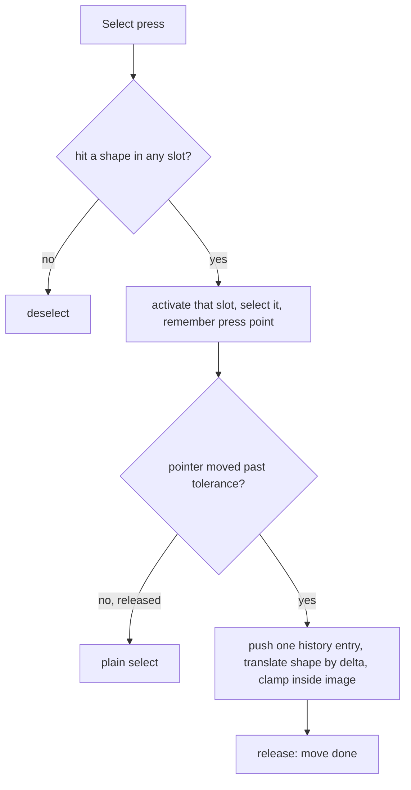

# Text Annotations - Plan

## Goal Capsule

- **Objective:** A user can put a short text label on a screenshot, in single or two-up layout, and it appears in the export exactly where they placed it, legible over any background.
- **Means:** A `text` shape type in the existing per-slot annotation model, created and edited through a DOM text field floated over the preview, drawn by `paint()` as a pill (KTD1, KTD3).
- **Authority:** Product Contract requirements win on behaviour; Key Technical Decisions win on mechanism within their cited requirements; units override neither.
- **Stop conditions:** Stop and report if labels cannot be drawn by the same paint path as other shapes (they must never be overlay-only), or if the single-layout reference exports change for images without labels.
- **Execution profile:** One static `index.html`, vanilla JS, no build, no dependencies, no network. Verification is CDP-driven in headless Chrome and logged in `docs/plan.md`, as the two previous features were; the harness lives outside the repo.
- **Finishes and ships:** `ce-work` implements and verifies; the user reviews the visual result before merge.

---

## Product Contract

### Summary

Add a Text tool beside Arrow, Box and Ellipse. Clicking on an image opens an inline editor; Enter commits a single-line label stored in that image's own pixels, drawn as a coloured pill with contrasting text and sized by the weight slider. With Select, labels (and now every other shape) can be dragged to move, and a label can be double-clicked to re-edit. Everything works identically in single and two-up.

### Problem Frame

Arrows, boxes and ellipses point at things but cannot say what they are. A before/after pair in particular wants a word or two on each side. Text was offered and deliberately left out of the first annotation pass (`docs/plan.md` §6), and Before/After slot captions were deferred in the two-up plan (`docs/plans/2026-09-17-2000-feat-two-up-collage-layout-plan.md`, Key Decisions and Deferred to Follow-Up Work); the user now wants free-placed labels on the photos in both layouts.

### Requirements

**Creating a label**

- R1. A Text tool joins the tool palette with shortcut `T`; a click on an image with it opens an inline single-line editor at the click point, focused and empty.
- R2. Enter, or focus leaving the editor, commits the trimmed text as a label anchored at the click point in that image's source pixels; Escape cancels; an empty or whitespace-only label is discarded with no history entry.
- R3. A committed label is nudged so its whole pill lies inside the image; a label placed near an edge therefore moves in rather than clipping. A label wider than the image is the one exception: it is anchored at the image's left edge and clipped, since it cannot fit.
- R4. Clicking with the Text tool on top of an existing label creates a new label, as the other tools ignore existing shapes when creating.

**Appearance**

- R5. A label renders as a rounded pill filled with the label's annotation colour, its text white or near-black by the fill's luminance, in the platform UI font stack, by the same paint routine as every other shape and clipped to its artwork.
- R6. Font size derives from the label's weight on the same relative scale as stroke width, so labels match across both slots in two-up and across preview and both export scales.
- R7. The inline editor shows the same colour, font size and padding as the committed pill at preview scale; its width is its own and the pill snaps to the measured width on commit.

**Selecting, moving, editing**

- R8. With Select, a click inside a label's pill selects it and ⌫ deletes it; the selection chrome outlines the pill.
- R9. With Select, dragging a selected or clicked shape of any type moves it, once the pointer has travelled past the existing stray-click tolerance; one move is one undo step.
- R10. Double-clicking a label with Select reopens the editor with its text; Enter commits the change as one undo step, Escape leaves the label unchanged.
- R11. Changing the colour with a label selected retints it and pushes a history entry, as it does for shapes today; changing the weight resizes it live without a history entry, as it does for shapes today.

**Interruptions and safety**

- R12. While the editor has focus, keyboard shortcuts do not fire: tool keys, digits, ⌫, ⌘Z, ⌘S, ⌘O and ⌘C all pass through to the text field, and an image paste is ignored.
- R13. Any action that would change what the editor is attached to first commits a non-empty label or discards an empty one: a press anywhere on the overlay, a layout switch, a file dropped or picked into any slot, Clear, Clear all, Reset crop, undo, and the crop tool. An image paste while the editor has focus is ignored (R12), so it is not an interruption.
- R14. The editor stays over its anchor point through re-renders (window resize, sidebar reflow, display change) and disappears in the export, which never draws it.

**Two-up and documentation**

- R15. A label belongs to the slot it was created in and follows that slot through crops, layout switches, parking and both export scales; the two-up pointer routing (empty slot activates only, other slot activates then continues) is unchanged.
- R16. README and `docs/plan.md` describe the tool and reverse the §6 "no text" scope call with a note.

### Key Decisions

- **Free-placed labels, not slot captions.** Labels are annotations that follow the image. (session-settled: user-approved — chosen over per-slot Before/After captions and over shipping both: captions widen the ask and can be added later on top of the same shape type.) Governs R1, R15.
- **Pill background in the palette colour, weight slider sets size.** (session-settled: user-approved — chosen over plain shadowed text and a per-label toggle: a filled pill stays legible over busy screenshots without a new control.) Governs R5, R6, R11.
- **Placement anywhere on the image, clipped like shapes.** (session-settled: user-approved — chosen over canvas-wide placement, which needs a second coordinate space and cannot follow a crop.) Governs R3, R5, R15.
- **Select to move, double-click to edit, single line.** (session-settled: user-approved — chosen over multi-line and place-and-forget.) Governs R8, R9, R10.
- **Drag-to-move applies to every shape type**, not only labels. (session-settled: user-approved — raised as a scoping call-out and confirmed; chosen over text-only moving: the gesture is identical, and leaving arrows and boxes immovable would make the tools inconsistent.) Governs R9.
- **Existing retint semantics carry over**: colour changes push history, weight changes do not. Governs R11.

### Success Criteria

- Placing a label takes one click and typing, and the exported PNG shows the pill at the same image feature as the preview at 1× and 2×.
- Images without labels export byte-identically to the current build.
- Console stays clean and the page makes zero network requests, including while the editor is open.

### Scope Boundaries

- Single-line labels only; no wrapping, no font picker, no per-label size control, no rotation.
- No slot captions in the padding and no "Before"/"After" presets; both stay in Deferred.
- Labels use the platform font stack, so an export made on another machine may render the text with a different face. This is the same trade-off the app already makes for its own UI and is documented.

#### Deferred to Follow-Up Work

- Per-slot Before/After captions in the padding (the deferred item from the two-up plan).
- Multi-line labels, a font or size control separate from weight, and a text-only (no pill) style.
- Resizing arrows, boxes and ellipses by their handles; only moving is added here.
- An in-repo automated test harness.

### Acceptance Examples

- AE1. **Covers R1, R2, R5.** Given a 1440×900 image and the Text tool, when the user clicks at (600, 400) in image pixels, types "Before", and presses Enter, then a red pill reading "Before" in white is drawn with its top-left at (600, 400) and appears in the 1× and 2× exports at the same feature.
- AE2. **Covers R2.** Given the editor open with "   " typed, when focus leaves it, then no label exists, the undo button stays disabled, and the editor is gone.
- AE3. **Covers R3.** Given a click 10 pixels from the image's right edge, when "Overflow" is committed, then the whole pill is inside the image and its right edge touches the image edge.
- AE4. **Covers R9.** Given a label and an arrow, when each is dragged 200 image pixels right with Select, then both move by 200 pixels, two undo entries exist, and one ⌘Z restores only the last move.
- AE5. **Covers R10.** Given a label "Befor", when it is double-clicked, "e" is appended and Enter pressed, then the label reads "Before", one undo entry was added, and ⌘Z restores "Befor".
- AE6. **Covers R12, R13.** Given the editor open with "After" typed in the right slot, when the user presses `1` (which reaches the field) and then clicks the left slot, then "After" is committed in the right slot, the left slot becomes active, and no other tool changed.
- AE7. **Covers R12, R13.** Given the editor open with text, when an image is pasted, then the paste is ignored and the editor stays open; when an image file is dropped on the other slot instead, the label is committed to its slot first and the drop lands in the other slot.
- AE8. **Covers R14.** Given the editor open, when the window is resized, then the editor's box is still over the same image point.
- AE9. **Covers R15.** Given a label in the right slot, when the layout switches to single and back, then the label returns with the slot.

### Sources

- `index.html`: `TOOLS` table (line 696), `drawShapes` (1093), `hitShape` (1580), `hitShapeAny` (1615), overlay `pointerdown` (1627) and `pointermove` (1682), `endDrag` (1731), `selectCell` (1785), `setTool` (1762), `pushHistory`/`undo` (1507, 1513), colour and weight retint (2228–2249), `isTyping` and the keydown handler (2524, 2530), the paste listener (2512), `.shotwrap` and `#overlay` CSS (123–125).
- `docs/plan.md` §6 (annotation model, text deliberately excluded) and §7 (two-up slot model, deferred captions).
- `docs/plans/2026-09-17-2000-feat-two-up-collage-layout-plan.md` for the slot vocabulary and the CDP verification convention.

---

## Planning Contract

### Key Technical Decisions

- KTD1. **A label is a one-point shape with a measured box.** `{ type:'text', x1, y1, text, color, weight }` in the slot's source pixels; no `x2`/`y2`. A helper computes the pill box from the text: font size `F = 3.2 × strokeWidth(L, shape)` in cell units (minimum 10), width from `measureText` on an offscreen context at a fixed 64 px reference size scaled to `F` (glyph advances are not linear in size on the platform stack, so measuring once at a reference keeps the box canonical across preview and export), plus `0.55F` padding each side, height `1.5F`, then divided by the slot's `k` to land in source pixels. `drawShapes` draws the text with `fillText`'s max-width argument set to the pill's inner width at the current `S`, so glyphs can never spill past the pill at any scale. Every consumer that assumes two points (`drawShapes`, the selection outline in `paintOverlay`, `hitShape`, and the new move code) branches on `type === 'text'` and uses that box. Measurements are cached on `text` (Governs R5, R6, R8).
- KTD2. **Pill and text colours.** Fill is the label colour; the text is whichever of `#FFFFFF` and `#16181B` has the higher WCAG contrast ratio against the fill (equivalently, dark text once the fill's relative luminance exceeds about 0.18). For the six palette colours that gives white text on red, blue and near-black, and dark text on orange, green and white; a plain 0.5 luminance cut would put white on green and orange at under 2.2:1. The same soft drop shadow the shapes use sits under the pill. Font: `600 <F·S>px ui-sans-serif, -apple-system, BlinkMacSystemFont, "Segoe UI", sans-serif`, matching the placeholder text the overlay already draws (Governs R5).
- KTD3. **The editor is a DOM `<input type="text">` inside `.shotwrap`,** absolutely positioned from the slot's `ax/ay`, `k`, `fit` and `dpr`, styled with the pill's colour, font size `F·fit` css px and matching padding and radius, `maxlength` 120, and an `aria-label` ("Label text") set at creation like the other dynamically built controls. It opens on pointer release, not press: the Text-tool press records a `text` drag kind at the clamped point and `endDrag` opens and focuses the field, so the browser's mousedown focus step (which fires after `pointerdown` and would blur a field focused there) has already run. It is repositioned by `render()` on every frame it is open, and it is never on a canvas, so it cannot reach an export. Commit is guarded by a `done` flag set synchronously before either the Enter or the blur path runs, so the second event is a no-op (Governs R1, R2, R7, R14).
- KTD4. **One interruption rule.** `closeEditor(commit)` is the single entry point: commit non-empty text (after nudging the pill inside the image, R3), discard empty text, remove the field. Every state change that could detach the editor calls it first: every `pointerdown` on the overlay before any branch runs (the pointer event precedes the focus change, so blur cannot be relied on to commit first; a second Text-tool click in the same slot therefore commits the first label and then opens a fresh editor), `selectCell`, `setLayout`, `setSource`, `clearImage`, Clear all, Reset crop, `undo`, and `setTool` when leaving Text. This mirrors how those paths already commit an open crop through the select-tool path (Governs R13).
- KTD5. **Keyboard while typing.** `isTyping` already covers `input[type=text]`; the ⌘Z, ⌘S and ⌘O branches and the image `paste` listener gain the same `isTyping` guard that ⌘C already has, so nothing mutates cells while the field owns the keyboard (Governs R12).
- KTD6. **Move for every shape, with a threshold.** In Select, a press that hits a shape records `{ kind:'move', idx, cell, start, orig }`; movement is applied only after the pointer has travelled more than `tolerance(vs)` from the press, at which point one history entry is pushed and the shape's points (both for two-point shapes, the anchor for text) translate by the delta. Clamping is per axis and applies only when the shape's bounding box fits the visible content rect on that axis; a shape wider or taller than the content rect (drawn before a tight crop) translates freely on that axis and stays clipped to the artwork as today. Release with no movement is a plain select (Governs R8, R9).
- KTD7. **Double-click reopens the editor** on the selected label using the browser's `dblclick` on the overlay, pre-filled; commit replaces `text` after one history push, Escape restores the original (Governs R10).
- KTD8. **Nudge, don't clip, on commit.** After measuring, the anchor is moved so the box lies inside the image's content rect; a label wider than the image is left anchored at the left edge and clipped, since that is unrepresentable otherwise (Governs R3).
- KTD9. **Retint semantics unchanged.** The colour swatch pushes history and recolours the selected label; the weight slider resizes it live without a push, exactly as for shapes (Governs R11).

### High-Level Technical Design

Editor lifecycle and the single interruption rule.

```mermaid
stateDiagram-v2
  [*] --> Closed
  Closed --> Open: Text-tool click on an image, or Select double-click on a label
  Open --> Committing: Enter, or focus leaves the field, or any interrupting action
  Open --> Closed: Escape (discard; edit restores original text)
  Committing --> Closed: non-empty text -> nudge inside, push history, add or update label
  Committing --> Closed: empty text -> discard, no history
  note right of Open
    done flag is set on the first path taken,
    so Enter followed by blur commits once
  end note
```

Select-tool press routing with move.

---

## Implementation Units

### U1. Text shape: model, rendering, hit-testing, tool entry

- **Goal:** Add the `text` shape type with its measured box, pill rendering, selection chrome and hit-test, plus the Text tool and `T` key, so a label can exist and be drawn once created.
- **Requirements:** R1 (tool and key), R5, R6, R8, R15; KTD1, KTD2.
- **Dependencies:** none.
- **Files:** `index.html` (`TOOLS`, `drawShapes`, `paintOverlay` selection outline, `hitShape`, new `textBox`/`textFont` helpers next to `strokeWidth`).
- **Approach:**
  1. Add `{ id:'text', label:'Text', key:'t' }` with a "T" glyph to `TOOLS`.
  2. Add `textFont(L, shape)` and `textBox(L, slot, shape)` per KTD1 with a small measurement cache; `drawShapes` draws the pill and text for `type === 'text'` with the luminance rule from KTD2.
  3. `hitShape` treats a label as hit when the point is inside its box; `paintOverlay` outlines the box for a selected label.
  4. Nothing creates a label yet; a temporary hook is not added. Verification uses U2's editor.
- **Patterns to follow:** existing `drawShapes` branch structure; overlay placeholder font; `strokeWidth` for scale.
- **Test scenarios:** the behaviour is exercised in U2 (creation, appearance, R6, R7) and U3 (selection, deletion, R8) once labels can be created. Unit-local: reference exports for images without labels stay byte-identical.
- **Verification:** Parity diff of the five reference exports is unchanged; the Text tool appears in the palette and `T` selects it.

### U2. Inline editor: create, commit, cancel, nudge

- **Goal:** Clicking with the Text tool opens the floated editor; Enter or blur commits a label, Escape cancels, empty text is discarded, the pill is nudged inside the image.
- **Requirements:** R1, R2, R3, R4, R7, R14; KTD3, KTD8.
- **Dependencies:** U1.
- **Files:** `index.html` (new editor element and CSS under `.shotwrap`, `openEditor`/`closeEditor`/`positionEditor`, `pointerdown` Text branch recording the `text` drag kind, `endDrag` `text` kind, `render` hook).
- **Approach:**
  1. The Text-tool press clamps the point to the content rect (as the draw branch does) and records `drag = { kind:'text', at:p }`; on release within the stray-click tolerance, `endDrag` calls `openEditor(slotIdx, x, y, existing)` at the press point (a press that travelled further is discarded and opens nothing, so a habitual drag from the other tools does not misplace a label), which creates the field on demand inside `#shotWrap`, positions and styles it per KTD3, and focuses it. Opening on release keeps the browser's mousedown focus change from blurring the new field.
  2. Enter and blur both call `closeEditor(true)`; Escape calls `closeEditor(false)`; the `done` flag makes the second call a no-op.
  3. On commit: trim; discard if empty; otherwise measure, nudge per KTD8, `pushHistory()`, push the label onto that slot's shapes, `requestRender()`.
  4. `render()` calls `positionEditor()` when the editor is open so it tracks fit and dpr changes.
- **Patterns to follow:** `toast()` for a one-shot DOM element; `endDrag`'s stray-click discard.
- **Test scenarios:**
  - Covers AE1. Click at a known image point, type "Before", Enter: pill drawn at the anchor; the mapped point is the pill colour in the preview, the 1× export and the 2× export.
  - Text colour per palette swatch: white on red, blue and near-black; dark on orange, green and white (sample a glyph pixel in each).
  - Covers R6. Two labels at weight 46, one in each two-up slot (1440×900 beside 1280×800): the pills are the same height in composition units and in the 1× export, and the height equals 1.5 × 3.2 × the stroke width for that weight.
  - Covers R7. While the editor is open, its computed font size equals the pill font size at preview scale and its background is the label colour; after Enter, the pill width equals the measured text width plus padding, not the field's width.
  - Covers AE2. Type spaces only and blur: no label, undo disabled, editor removed.
  - Escape with text typed: no label, no history.
  - The opening click itself never closes the editor: after a Text-tool click the field is focused and still present on the next frame.
  - Text-tool press dragged past the stray-click tolerance: no editor opens, no label, no history.
  - The editor field exposes an accessible name ("Label text").
  - Enter then the blur that follows it: exactly one label and one history entry.
  - Covers AE3. Click near the right edge and commit "Overflow": the pill's right edge equals the image's right edge.
  - Text tool click on top of an existing label: a second label is created.
  - Editor open with text, Text-tool click elsewhere in the same slot: the first label is committed with its own history entry, then a new empty editor opens at the second point.
  - Editor open with text, Select click on an arrow in the same slot: the label is committed first, then the arrow is selected; history has the label entry only.
  - Covers AE8. Editor open, viewport resized: editor box still over the anchor (its css position tracks the overlay rect).
  - Export while the editor is open: the export has no editor pixels; the label (if committed) does appear.
  - 2× export of a label: no text-coloured pixels outside the pill fill.
  - A label with `maxlength` reached: input stops accepting characters, no error.
  - Two-up: click in the right slot with the Text tool while the left is active: right slot activates and the label lands in the right slot's shapes.
- **Verification:** Scenarios pass in the CDP session; console clean; zero network.

### U3. Move any shape; double-click to edit; interruption and keyboard guards

- **Goal:** Select drags move shapes with a threshold and one undo step; double-click re-edits a label; every detaching action closes the editor first; shortcuts and image paste yield while typing.
- **Requirements:** R9, R10, R11, R12, R13; KTD4, KTD5, KTD6, KTD7, KTD9.
- **Dependencies:** U2.
- **Files:** `index.html` (`pointerdown` Select branch, `pointermove` new `move` kind, `endDrag`, `dblclick` listener on the overlay, `selectCell`, `setLayout`, `setSource`, `clearImage`, Clear all and Reset crop handlers, `undo`, `setTool`, keydown ⌘Z/⌘S/⌘O branches, paste listener).
- **Approach:**
  1. Select press on a hit shape records a `move` drag; `pointermove` applies the translation after the threshold and pushes history once; `endDrag` finalises. Two-point shapes translate both points; a label translates its anchor and is re-nudged inside.
  2. `dblclick` on a label with Select opens the editor pre-filled; commit replaces `text` (one push); Escape restores.
  3. Insert `closeEditor(true)` at the head of each detaching path named in KTD4.
  4. Add the `isTyping` guard to ⌘Z, ⌘S, ⌘O and to the image paste listener.
- **Patterns to follow:** `crop-move` drag kind; `selectCell`'s commit-first ordering; the ⌘C guard.
- **Test scenarios:**
  - Covers AE4. Drag a label and an arrow 200 image px each: both moved, two undo entries, ⌘Z restores only the last.
  - Click a shape without moving: selected, no history entry.
  - Covers R8. Select click inside a label's pill: the label is selected, the overlay outlines the pill's box, and ⌫ removes it with one history entry.
  - Drag a label towards the edge: it stops with its pill inside the image.
  - Crop a slot inside an existing box, then drag the box: it moves, stays clipped to the artwork, no exception, one history entry.
  - Covers AE5. Double-click "Befor", append "e", Enter: text updated, one history entry; ⌘Z restores.
  - Double-click then Escape: text unchanged, no history.
  - Covers AE6. Editor open in the right slot, press `1`: the character lands in the field; click the left slot: label committed to the right slot, left becomes active, tool unchanged.
  - Covers AE7. Editor open with text, paste an image: ignored, editor still open; drop an image file on the other slot: label committed first, then the drop lands there.
  - Editor open, switch layout to single: label committed and parked with its slot; back to two-up it is there.
  - Editor open with text, ⌘Z: the label is committed first and ⌘Z does not fire (the field owns the key); after Enter, ⌘Z removes the label.
  - Editor open, press `c`: the character is typed, the tool does not change.
  - Colour swatch with a label selected: pill recolours, one history entry; weight slider: pill resizes, no history entry.
  - Moving an ellipse and a box in the scaled two-up slot: they land where dropped at 1× and 2× export.
- **Verification:** Scenarios pass; every earlier suite still passes; console clean.

### U4. Documentation and verification log

- **Goal:** Describe the Text tool and the move gesture, reverse the §6 scope call, and log the verification.
- **Requirements:** R16.
- **Dependencies:** U1 to U3.
- **Files:** `README.md`, `docs/plan.md`.
- **Approach:** README "Cropping and annotating" gains the Text tool, the `T` key, the pill behaviour, drag-to-move and double-click editing; `docs/plan.md` §6 gets a note that text was added later on request, and a new §8 in the §7 shape: model, verification table, found-and-fixed list.
- **Test scenarios:** Test expectation: none -- documentation only; claims are the measured results from U2 and U3.
- **Verification:** The docs describe the shipped behaviour with the measured numbers.

---

## Verification Contract

| Check | Applies to | Passes when |
|---|---|---|
| Reference export diff (five captures, no labels) | U1, U2, U3 | Byte-identical to the current build |
| CDP-driven scenario run (real pointer and key events, text typed into the editor, canvas pixel assertions, exports read back) | U2, U3 | Every listed scenario passes; results logged in `docs/plan.md` §8 |
| Existing two-up and single suites | U1 to U3 | Still green |
| Console clean and zero network requests over a full session including editing | all | No console messages; no requests after load |
| Lighthouse accessibility on `index.html` | U1, U2 | Score stays 100; the Text tool radio is labelled; the editor field is a labelled input |

The repo has no automated harness and adding one stays deferred; the CDP session is the proof, and its results are written into `docs/plan.md`.

---

## Definition of Done

- Every requirement R1 to R16 is demonstrated by a passing scenario or a documented measurement.
- Exports without labels are byte-identical to the current build; exports with labels show the pill at the anchored feature at both scales.
- The editor never appears in an export and every detaching action closes it first.
- `docs/plan.md` §8 and README describe the feature with measured numbers.
- No dead code from abandoned approaches remains in `index.html`; the file still opens from `file://` with no build step and no dependencies.
